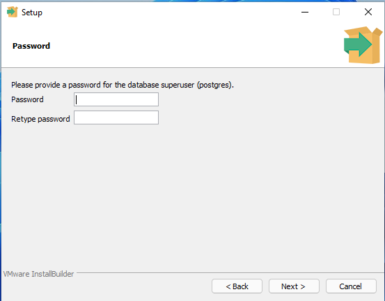
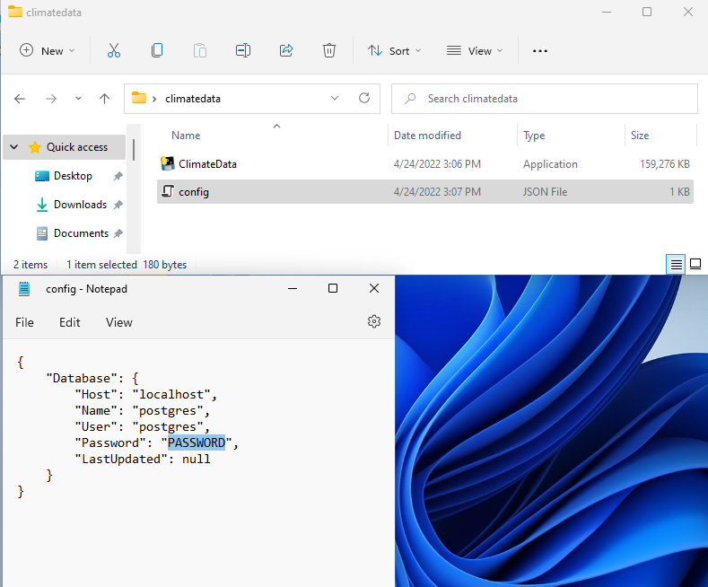
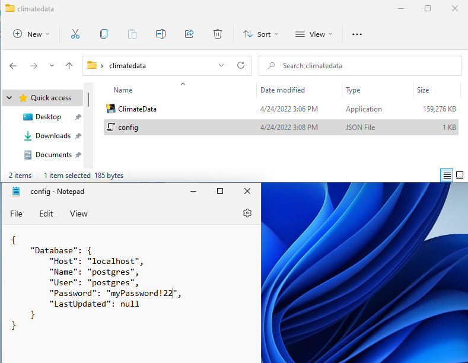

<div id="top"></div>

<!-- PROJECT LOGO -->
<br />
<div align="center">
  <h3 align="center">Climate Data Analysis Capstone</h3>

  <p align="center">
    A tool to analyze over a hundred years of climate data.
    <br />
  </p>
</div>


<!-- TABLE OF CONTENTS -->
<details>
  <summary>Table of Contents</summary>
  <ol>
    <li>
      <a href="#about-the-project">About The Project</a>
    </li>
    <li>
      <a href="#getting-started">Getting Started</a>
      <ul>
        <li><a href="#prerequisites">Prerequisites</a></li>
        <li><a href="#installation">Installation</a></li>
      </ul>
    </li>
    <li><a href="#usage">Usage</a></li>
    <li><a href="#license">License</a></li>
  </ol>
</details>


<!-- ABOUT THE PROJECT -->
## About The Project

TBD.

<p align="right">(<a href="#top">back to top</a>)</p>


<!-- GETTING STARTED -->
## Getting Started

To get a local copy up and running follow these steps.

### Prerequisites

The following software is needed in order to use this application.

* Postgres
  
  1. Visit [https://postgressql.org](https://www.postgresql.org/) and download the installer for your Operating system.
  2. Run the installer and continue through each page with default settings.
  3. On the password page enter a password. Save this password because you will need it later.

     

  4. Continue through the next pages with the default settings to finish the installation.

### Installation

1. Download the latest release from [here](https://github.com/MaxCarlson/ClimateData/releases).
2. Run the program. On first time startup, it will create a ```config.json``` file and close.
3. In a text editor, open the newly created ```config.json``` file located in the same directory as the ```ClimateData``` program.

      

4. Replace the ```PASSWORD``` text with the password you used when installing Postgres and save the file. Make sure that your password is surrounded in quotation marks like so:

      

5. Run the program again. This time it will start to download all the necessary climate data.
      
      

6. If everything is configured correctly the UI will launch.

<p align="right">(<a href="#top">back to top</a>)</p>

<!-- BUILD INSTRUCITONS -->
## Building from source
To build an executable, use pyinstaller.

```pip install pyinstaller```

First install all requirements from the requirements.txt file.

```pip install -r .\requirements.txt```

Then run pyinstaller on the .spec file

```pyinstaller .\ClimateData.spec```

This should result in two new folders, dist and build. The dist folder contains the executeable and everything needed to run it.


<!-- USAGE EXAMPLES -->
## Usage

TBD.

<p align="right">(<a href="#top">back to top</a>)</p>

<!-- LICENSE -->
## License

TBD.

<p align="right">(<a href="#top">back to top</a>)</p>


